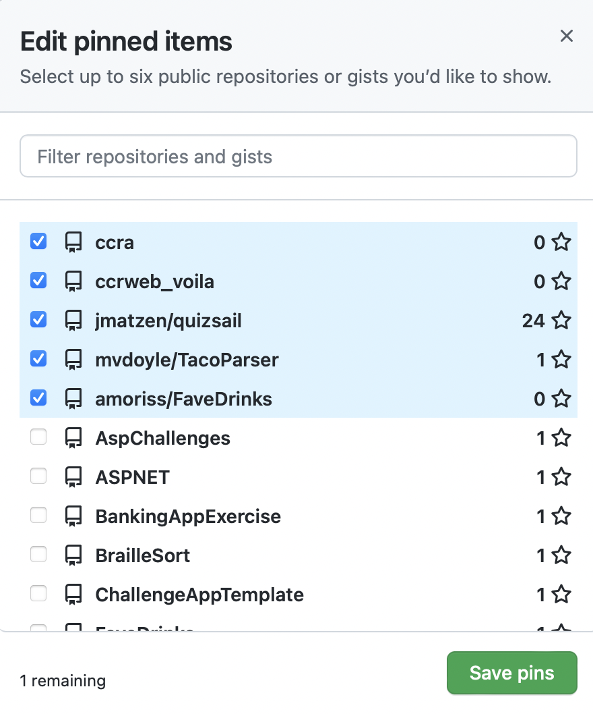
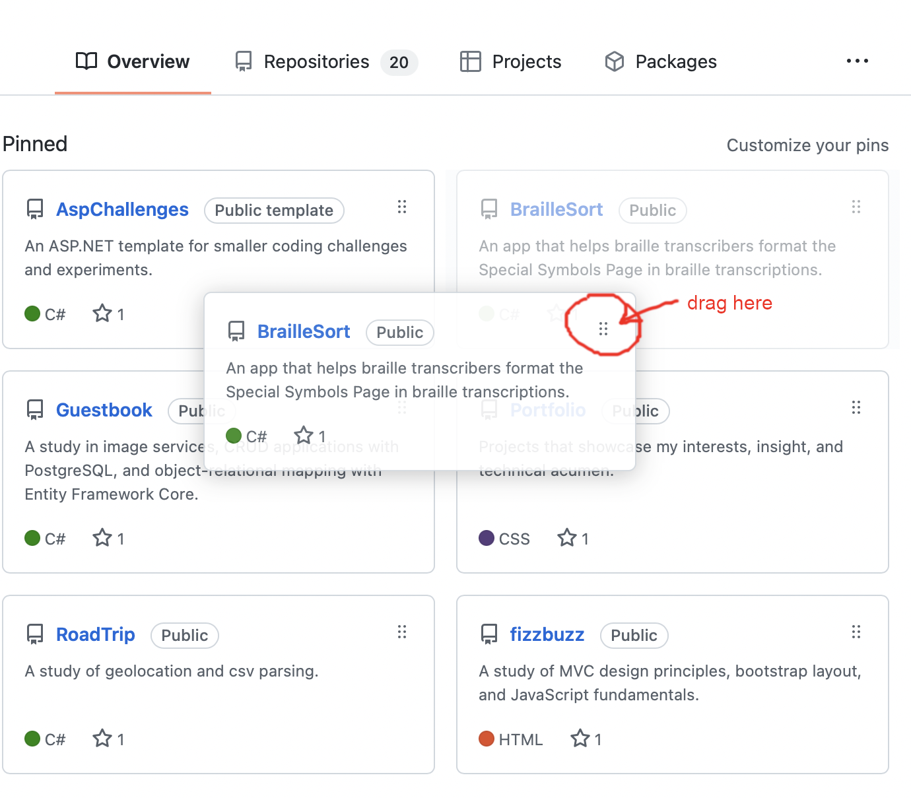

# Update Pins on Landing Page

1. On you landing page, click "Customize your pins"

{:refdef: style="width: 100px"}

{: refdef}

2. Select up to 6 projects.

{:height="36px" width="36px"}

3. Rearrange projects using the 6 dots in the upper-right corner of each project.

{:height="50%" width="50%"}

